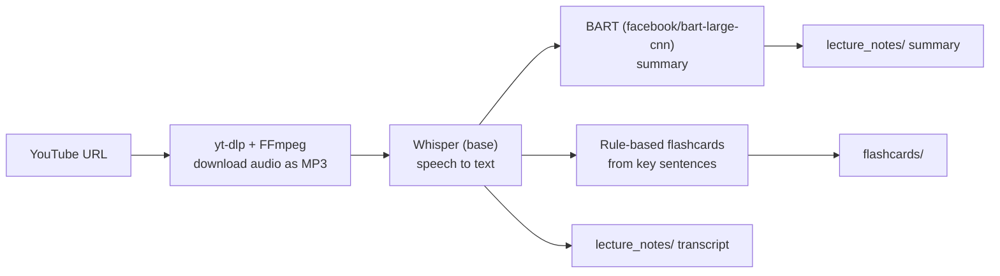

# 🎓 Microlearning Generator

**Turn a YouTube lecture into a transcript, a short summary and study flashcards** with one command.


**Jump to:** [Pipeline](#-pipeline) · [Run it](#-run-it) · [Output](#-output) · [Limitations](#-limitations)

---

## 🧭 Pipeline



| Step | Tool | What it does |
|---|---|---|
| 1. Download | `yt-dlp` + FFmpeg | Fetches the video's audio and converts it to MP3 |
| 2. Transcribe | OpenAI Whisper (`base` model) | Speech to text, saved as a transcript |
| 3. Summarize | Hugging Face `facebook/bart-large-cnn` | Summarizes the first ~50 sentences (up to 4,000 characters) into a short summary (50 to 150 tokens) |
| 4. Flashcards | NLTK sentence splitting | Builds 5 simple Q&A cards from the first sentences of the transcript |

The project is organized as a small pipeline: `main.py` validates the URL and calls `run_pipeline` in `utils/generator.py`, which chains the download, transcription and processing modules.

---

## 🚀 Run it

**Requirements:** Python 3.8+, [FFmpeg](https://ffmpeg.org/) installed and on your PATH.

```bash
git clone https://github.com/Sajal-10903/MicrolearningGenerator.git
cd MicrolearningGenerator
pip install -r requirements.py     # the dependency list (yt-dlp, whisper, transformers, nltk, torch, ...)
python main.py
```

Paste a YouTube URL when prompted. The first run downloads the Whisper and BART models.

---

## 📁 Output

| Folder | Contents |
|---|---|
| `downloads/` | Downloaded audio |
| `lecture_notes/` | `<id>_transcript.txt` and `<id>_notes.txt` (summary) |
| `flashcards/` | `<id>_flashcards.txt` (Q&A pairs) |

---

## ⚠️ Limitations

- **Destructive cleanup:** each run deletes `downloads/`, `lecture_notes/`, `flashcards/` **and the Whisper and Hugging Face model caches in your home directory** (`~/.cache/whisper`, `~/.cache/huggingface`), so models re-download every run. Back up any output you want to keep.
- **Flashcards are simple:** questions are generic ("What is a key point 1 from the lecture?") and the answers are the first five sentences, not the most important ones. There is no quiz generation yet.
- **Summary covers only the beginning** of long lectures (first ~50 sentences).
- YouTube URLs only (`youtube.com` and `youtu.be`).
- The repository also contains earlier, alternative LLM-based versions of some modules at the top level (`summarizer.py`, `flashcard_generator.py`, `generator.py`, `downloader.py`). The pipeline that `main.py` runs lives in `utils/`.

### Ideas for improvement

- Use an LLM or embedding-based ranking to pick key sentences and write real questions.
- Chunk long transcripts before summarizing.
- Add a quiz generator and support for local audio/video files and PDFs.

---

**Author:** [Sajal Raj](https://github.com/Sajal-10903) · [Portfolio](https://sajalraj-portfolio.vercel.app) · [LinkedIn](https://www.linkedin.com/in/sajal-raj-456b31252/)
